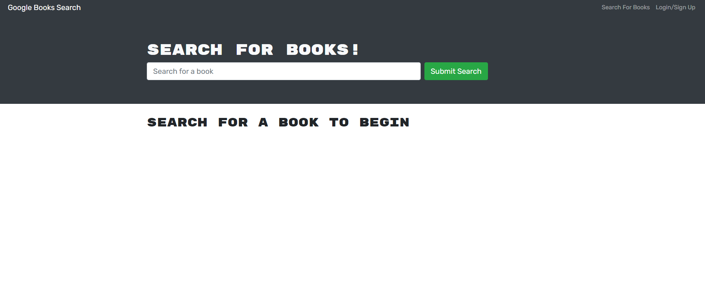

# Restful Refactor: Google Books

### **Description:**

Google Books is a fully functioning [API](https://en.wikipedia.org/wiki/API) search engine built with a RESTful API using the [MERN stack](https://www.mongodb.com/mern-stack) and a [React](https://reactjs.org/) front end, [MongoDB](https://www.mongodb.com/) database, and [Node.js/Express.js](https://expressjs.com/) server and API. Which allows users to save book searches to the back end, sign-in and out, and query Books data all while being presenting with a high-quality responsive and enjoyable user experience via our friend _**"React"**_. Our users are presented with a menu containing the options Search for Books and Login/Signup, as well as a input field to search for books. Google Books presents several search results, each featuring a book’s title, author, description, image, and a link to that book on the Google Books site.

 

### **Our Mission:**

We are working to refactor Gooogle Books API and incorperate new performant technologies including [Apollo Servers](https://www.apollographql.com/docs/apollo-server/getting-started/) and [GraphQL](https://en.wikipedia.org/wiki/GraphQL) replacing the existing restful API currently used. In addition we will Modify the existing authentication middleware so that it works in the correct context in GraphQL API. Last we will need to create an Apollo Provider so that requests can communicate with an Apollo Server.

 

**Initial Issues and Diclaimer:**

We are currrently experiencing a bug within our starting structure that is causing issues with the deployed product. We are working to fix this issue and have not been able to determine the a solution yet. We are working around the clock to de-bug and determine the root of the issue.

 

**Update**

Heroku deployment fixed, issue was cause by initial build pack that was intended for a static single page application. By removing current status buildpack and running a react/heroku default build as well as backend mongo atlas verification fixed.

**Deployment:**

 

- [Heroku](https://dashboard.heroku.com/apps)

- [MongoDB](https://www.mongodb.com/) Database

- [Apollo Servers](https://www.apollographql.com/docs/apollo-server/getting-started/)

 

**Development Server Start:**

 

        npm run develop

 

#

### **Web Preview:**

 

 

### **Links:**

#

Heroku deployed:
 
https://restfulrefactor.herokuapp.com/

GitHub repo:
 
https://github.com/SmithCray/RestfulRefactor

 

## **Author:**

#

### **Cray Smith**

GitHub Link:
 
https://github.com/SmithCray

Email:
 
cmsmith004@gmail.com

##  Copyright (c) [2021]   [Cray Smith] 

Permission is hereby granted, free of charge, to any person obtaining a copy
of this software and associated documentation files (the "Software"), to deal
in the Software without restriction, including without limitation the rights
to use, copy, modify, merge, publish, distribute, sublicense, and/or sell
copies of the Software, and to permit persons to whom the Software is
furnished to do so, subject to the following conditions:
The above copyright notice and this permission notice shall be included in all
copies or substantial portions of the Software.

THE SOFTWARE IS PROVIDED "AS IS", WITHOUT WARRANTY OF ANY KIND, EXPRESS OR
IMPLIED, INCLUDING BUT NOT LIMITED TO THE WARRANTIES OF MERCHANTABILITY,
FITNESS FOR A PARTICULAR PURPOSE AND NONINFRINGEMENT. IN NO EVENT SHALL THE
AUTHORS OR COPYRIGHT HOLDERS BE LIABLE FOR ANY CLAIM, DAMAGES OR OTHER
LIABILITY, WHETHER IN AN ACTION OF CONTRACT, TORT OR OTHERWISE, ARISING FROM,
OUT OF OR IN CONNECTION WITH THE SOFTWARE OR THE USE OR OTHER DEALINGS IN THE
SOFTWARE.
